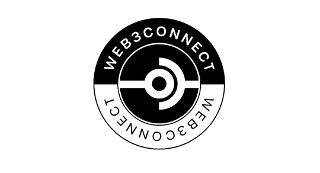

<p align="center">
  
  <br>
</p>

Features
------------

The Web3Connect SDK for JavaScript provides a rich set of client-side functionality that:

* Enables you to use the Login Button
* Enables you to use Login to lower the barrier for people to get wallet address id from Web3Wallet server
* Makes it easy to call into Web3Wallet's API.

Deploy documentation
--------------------

It is slate docs so we can use Slate documenatation. see https://github.com/slatedocs/slate/wiki/Using-Slate-in-Docker

We can use docker and then use below command to push the changes to our repository.

```shell
$ ./deploy --push-only
```

> After deployment, it can take upto 10 minutes to reflect the changes.

visit <a href="https://bit3xtechnologies.github.io/web3connect-docs/#quickstart">Web3Connect documentation</a>
to see updates